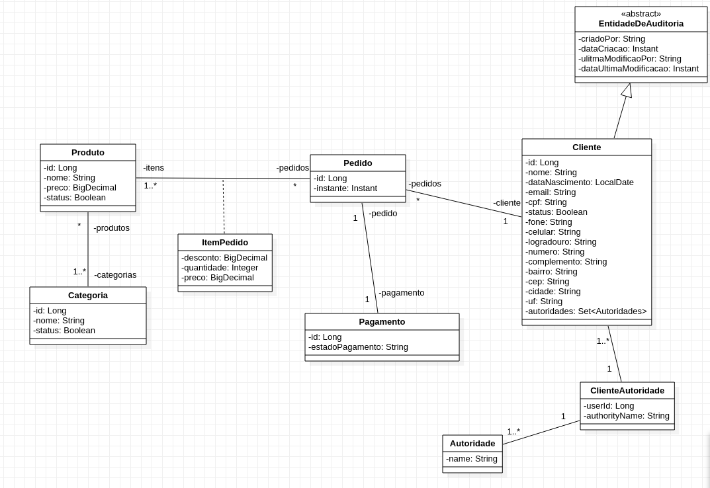

# Ecommerce Simples

Esse projeto faz parte de um sistema de avalização, que visa apresentar um modelo simples de ecommerce.

## Como executar localmente:

- Instale e use o postgresql.
- Crie um login/Group Roles no postgresql com usuario e senha ecommercesimples.
- Crie um banco de dados com o owner ecommercesimples criado anteriormente.

```
./mvnw
```

Então navegue para [http://localhost:8080](http://localhost:8080) em seu navegador.

## Diagrama de Classe



Projeto se encontra incompleto ainda.
